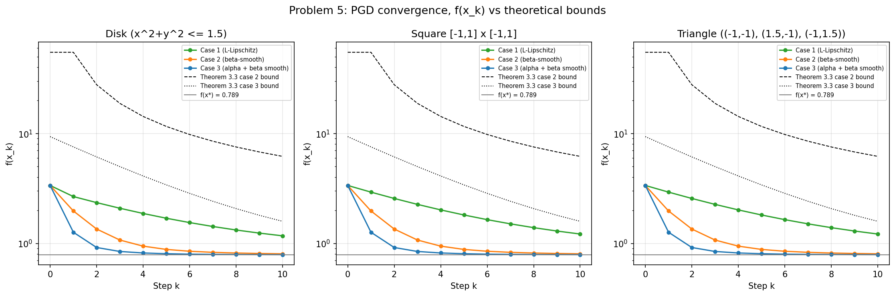
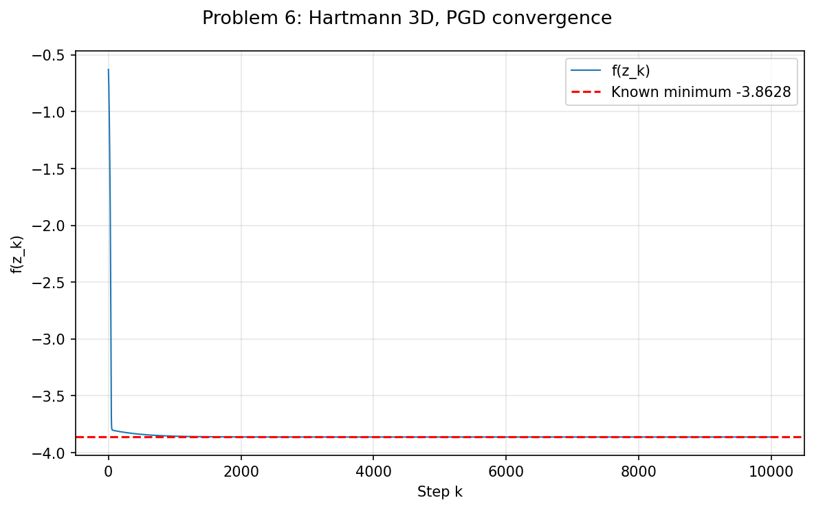

## Problem 5: Projected Gradient Descent

### Output

```
============================================================
PROBLEM 5: Projected Gradient Descent
============================================================

Constants from Problem 2:
  L     = 14.6720  (Lipschitz constant)
  beta  = 9.5220  (smoothness)
  alpha = 1.0654  (strong convexity)
  kappa = 8.9376  (condition number beta/alpha)

Unconstrained minimum (found numerically):
  x*    = (-0.4326, -0.2163)
  f(x*) = 0.789177

Starting point: x1 = [-1.  1.]
Distance to x*: R = ||x1 - x*|| = 1.3421
Number of steps: 10

Learning rates from Theorem 3.3:
  Case 1: gamma = R / (L * sqrt(T)) = 0.0289
  Case 2: gamma = 1 / beta          = 0.1050
  Case 3: gamma = 2 / (alpha + beta)= 0.1889

------------------------------------------------------------
Results after 10 steps (f(x*) = 0.789177):
------------------------------------------------------------

Domain: Disk (x^2+y^2 <= 1.5)
  Case 1 (L-Lipschitz) (gamma = 0.0289)
    Final x    = (-0.495572, 0.367582)
    Final f(x) = 1.172094  (difference = 0.382917, no bound computed for case 1)
  Case 2 (beta-smooth) (gamma = 0.1050)
    Final x    = (-0.355686, -0.084134)
    Final f(x) = 0.804358  (difference = 0.015181, Theorem 3.3 case 2 bound = 5.4035, satisfied = True)
  Case 3 (alpha + beta smooth) (gamma = 0.1889)
    Final x    = (-0.409098, -0.183716)
    Final f(x) = 0.790204  (difference = 0.001027, Theorem 3.3 case 3 bound = 0.7992, satisfied = True)

Domain: Square [-1,1] x [-1,1]
  Case 1 (L-Lipschitz) (gamma = 0.0289)
    Final x    = (-0.515428, 0.390992)
    Final f(x) = 1.217314  (difference = 0.428137, no bound computed for case 1)
  Case 2 (beta-smooth) (gamma = 0.1050)
    Final x    = (-0.355686, -0.084134)
    Final f(x) = 0.804358  (difference = 0.015181, Theorem 3.3 case 2 bound = 5.4035, satisfied = True)
  Case 3 (alpha + beta smooth) (gamma = 0.1889)
    Final x    = (-0.409098, -0.183716)
    Final f(x) = 0.790204  (difference = 0.001027, Theorem 3.3 case 3 bound = 0.7992, satisfied = True)

Domain: Triangle ((-1,-1), (1.5,-1), (-1,1.5))
  Case 1 (L-Lipschitz) (gamma = 0.0289)
    Final x    = (-0.515428, 0.390992)
    Final f(x) = 1.217314  (difference = 0.428137, no bound computed for case 1)
  Case 2 (beta-smooth) (gamma = 0.1050)
    Final x    = (-0.355686, -0.084134)
    Final f(x) = 0.804358  (difference = 0.015181, Theorem 3.3 case 2 bound = 5.4035, satisfied = True)
  Case 3 (alpha + beta smooth) (gamma = 0.1889)
    Final x    = (-0.409098, -0.183716)
    Final f(x) = 0.790204  (difference = 0.001027, Theorem 3.3 case 3 bound = 0.7992, satisfied = True)

------------------------------------------------------------
Best performer per domain (lowest f after 10 steps):
------------------------------------------------------------
  Disk (x^2+y^2 <= 1.5): Case 3 (alpha + beta smooth) (f = 0.790204)
  Square [-1,1] x [-1,1]: Case 3 (alpha + beta smooth) (f = 0.790204)
  Triangle ((-1,-1), (1.5,-1), (-1,1.5)): Case 3 (alpha + beta smooth) (f = 0.790204)
```

### Plot



### Discussion

- Case 3 converged best, difference of only $0.001$ from $f(x^*)$ after 10 steps.
- Bounds from Theorem 3.3 satisfied for cases 2 and 3, actual convergence much better than the bound.
- Since the GD steps never leave any of the three domains, projections never apply and all domains give identical results.

---

## Problem 6: Hartmann 3D Function

### Output

```
============================================================
PROBLEM 6: Hartmann 3D Function
============================================================

Starting point: z1 = [0.5 0.5 0.5]
Learning rate:  gamma = 0.001
Number of steps: 10000
Known minimum: -3.86278214782076

Results:
  Final point         = (0.114616, 0.555649, 0.852547)
  f at final point    = -3.8627821478
  Known minimum       = -3.8627821478
  Difference after 10000 steps = 2.59e-12
  Steps to get within 0.01 of minimum = 872
```

### Plot



### Discussion

- Gets within $0.01$ of the minimum in 872 steps, reaches $2.59 \times 10^{-12}$ after 10000 steps.
- No convergence guarantee since the function is not convex, but starting from the center worked well in practice.
